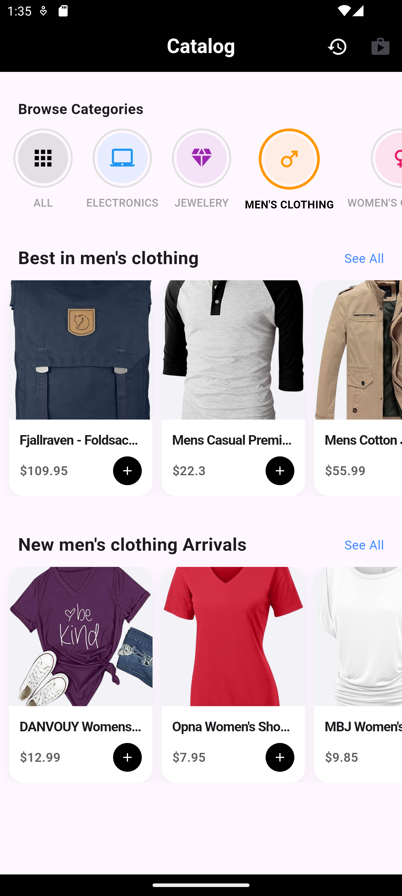

# 🪑 DeskFlow (Flutter E-Commerce)

A high-performance, offline-first E-Commerce application built with **Flutter** and **Clean Architecture principles**.

This project demonstrates a production-level implementation of **State Management (Cubit)** and **Local Persistence (Hive)**, featuring a complex cart system with smart inventory logic.

## 📱 App Preview

| **Smart Catalog** | **Reactive Cart** |
|:---:|:---:|
|  |  |
| **Grid Layout & Hero Animations** | **Instant State Updates** |

| **Checkout Form** | **Order History** |
|:---:|:---:|
|  |  |
| **Form Validation & Logic** | **Hive Database Persistence** |

## 🛠 Tech Stack

* **Framework:** Flutter (Dart)
* **State Management:** `flutter_bloc` (Cubit)
    * *Why?* Selected for predictable state flow and separation of business logic from UI.
* **Local Database:** `Hive` (NoSQL)
    * *Why?* Chosen for O(1) read/write speeds to ensure the cart persists instantly across app restarts.
* **Architecture:** Feature-First / Component-Based
    * Refactored UI into reusable widgets for maintainability.

## ✨ Key Features

### 1. 🧠 Smart Cart Logic
Unlike basic tutorials, this cart handles inventory logic intelligently:
* **Grouping:** Adding the same item multiple times increments the quantity (`x2`, `x3`) rather than duplicating rows.
* **Decrementing:** Reducing an item at `quantity: 1` automatically removes it from the cart.
* **Persistence:** The cart state is saved to the device disk instantly. You can kill the app, restart it, and your items remain.

### 2. ⚡ Reactive UI
* **Live Badge:** The cart icon in the AppBar updates instantly to reflect the total item count.
* **Hero Animations:** Product images seamlessly "fly" from the Catalog to the Detail screen.
* **Visual Polish:** Uses `SliverGrid`, `ClipRRect`, and custom `BoxDecoration` for a premium feel.

### 3. 🧾 Full Checkout Lifecycle
* **Validation:** Custom form validation logic ensures shipping details are correct before processing.
* **Order History:** Completed orders are serialized and stored in a separate Hive Box (`orders`), creating a permanent receipt record.

## 🚀 How to Run

1.  Clone the repository:
    ```bash
    git clone [https://github.com/MostafaL2003/DeskFlow.git](https://github.com/MostafaL2003/DeskFlow.git)
    ```
    *(Note: Update the link above if you chose a different name)*

2.  Install dependencies:
    ```bash
    flutter pub get
    ```
3.  Run the code generator (for Hive Adapters):
    ```bash
    flutter pub run build_runner build
    ```
4.  Run the app:
    ```bash
    flutter run
    ```

## 📂 Project Structure

```text
lib/
├── cubit/           # Business Logic (State Management)
├── models/          # Data Models & Hive Adapters
├── screens/         # Full Page Views (Catalog, Cart, Checkout)
├── widgets/         # Reusable Components (Product Cards, Inputs)
└── main.dart        # Entry Point & App Config
